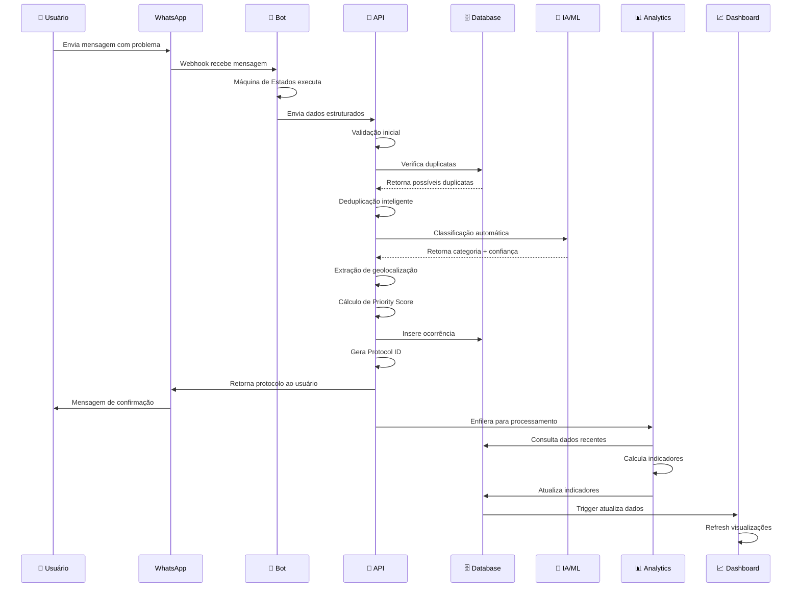
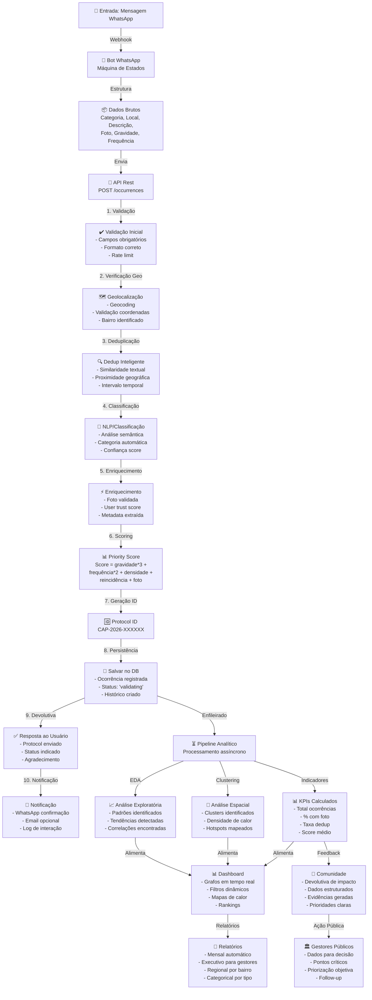
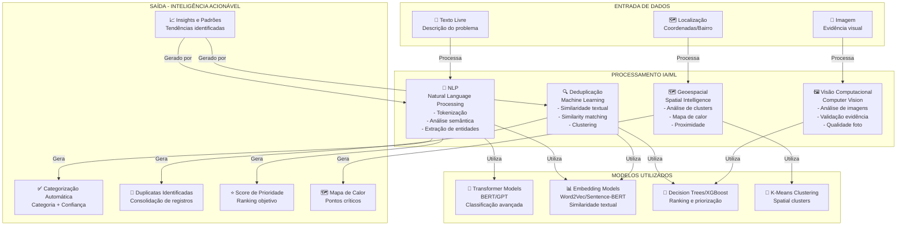
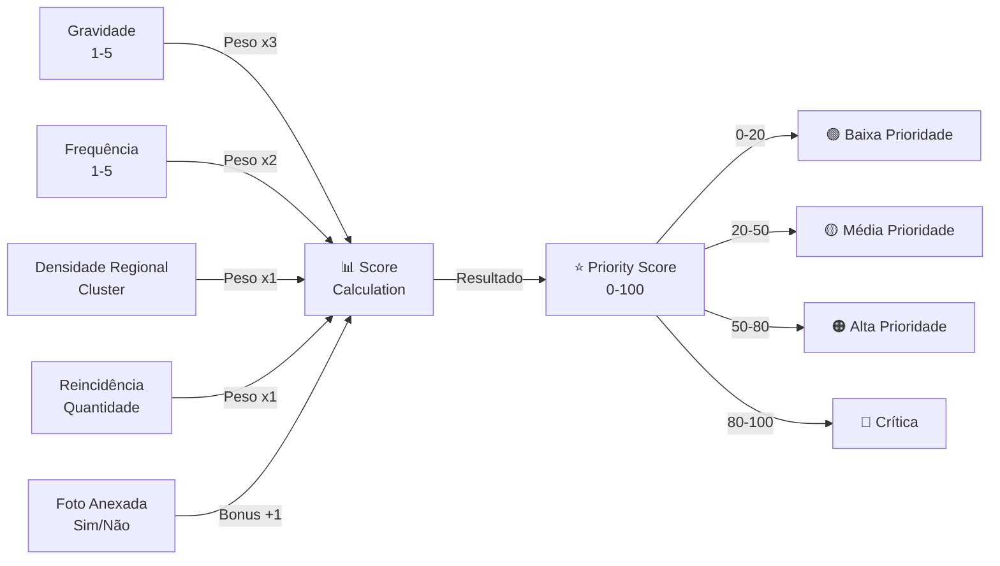
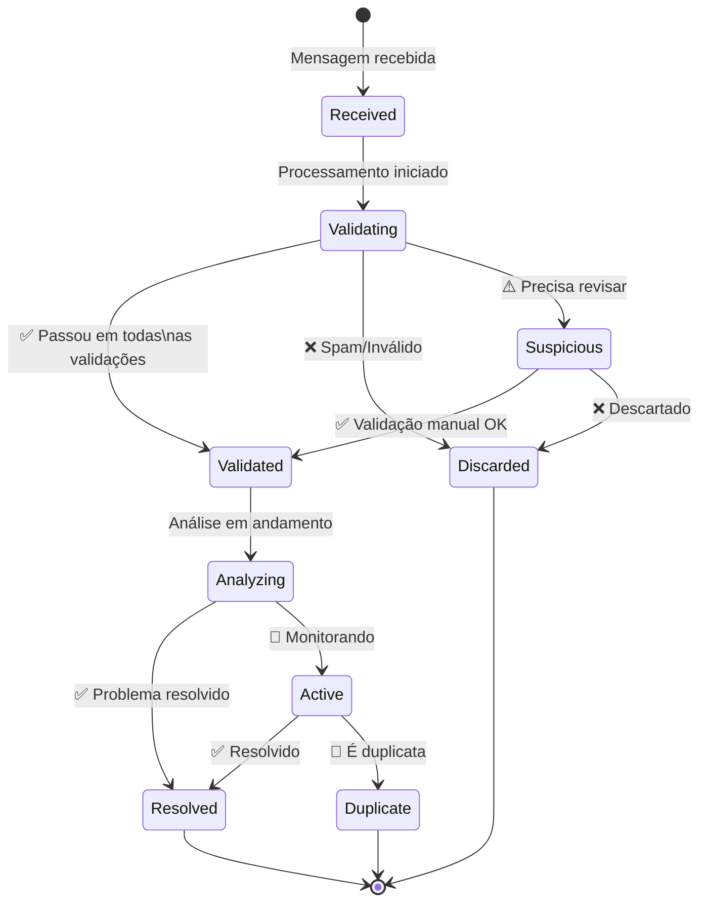
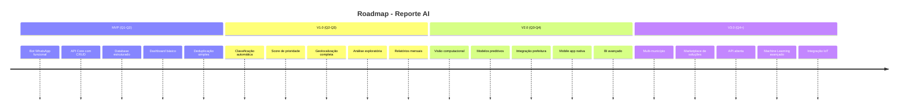

# 🏗️ DIAGRAMA DE ARQUITETURA - REPORTE AI

## 1. ARQUITETURA GERAL DO SISTEMA

```mermaid
graph TB
    subgraph "CAMADA DE APRESENTAÇÃO"
        WA["📱 WhatsApp<br/>Canal Principal"]
        DASH["📊 Dashboard<br/>Análises e Visualizações"]
        API_CLIENT["🖥️ API Client<br/>Frontend/App"]
    end

    subgraph "CAMADA DE INGESTÃO E ORQUESTRAÇÃO"
        BOT["🤖 Bot WhatsApp<br/>Fluxo Conversacional<br/>Machine de Estados"]
        WH["🔗 Webhook Manager<br/>Mensagens/Callbacks"]
    end

    subgraph "CAMADA CORE - BACKEND (Spring Boot)"
        RM["REST API Manager<br/>Endpoints REST"]
        OCC["Occurrence Service<br/>Registro de Ocorrências"]
        DEDUP["Deduplication Service<br/>Inteligência de Duplicatas"]
        CLASS["Classification Service<br/>NLP/Categorização"]
        GEO["Geolocation Service<br/>Processamento Geo"]
        SCORE["Scoring Service<br/>Cálculo de Prioridade"]
        VAL["Validation Service<br/>Controle de Qualidade"]
        NOTIF["Notification Service<br/>Comunicação com Usuário"]
    end

    subgraph "CAMADA DE PERSISTÊNCIA"
        PG["🗄️ PostgreSQL<br/>Banco Relacional<br/>+ PostGIS"]
        CACHE["⚡ Redis<br/>Cache/Sessions"]
    end

    subgraph "CAMADA DE ARMAZENAMENTO"
        S3["☁️ AWS S3<br/>Armazenamento de Imagens<br/>Evidências"]
    end

    subgraph "CAMADA ANALÍTICA (Python/SQL)"
        EDA["📈 Análise Exploratória<br/>Padrões e Tendências"]
        CLUSTER["🎯 Clustering<br/>Análise Espacial"]
        INDICATORS["📊 Cálculo de Indicadores<br/>KPIs"]
        REPORTS["📄 Geração de Relatórios<br/>Executivos e Analíticos"]
    end

    subgraph "SERVIÇOS EXTERNOS"
        MAPS["🗺️ Google Maps API<br/>Geocoding/Geolocation"]
        EMAIL["📧 Email Service<br/>Notificações"]
        AI["🧠 IA/ML Services<br/>Classificação Avançada"]
    end

    subgraph "MONITORAMENTO E LOGS"
        LOGS["📋 Logs Centralizados<br/>ELK Stack"]
        MONITOR["📡 Monitoring<br/>Prometheus/Grafana"]
    end

    -- Conexões
    WA -->|Mensagens| BOT
    BOT -->|Processa| WH
    WH -->|API Calls| RM
    
    RM -->|Orquestra| OCC
    OCC -->|Verifica| DEDUP
    DEDUP -->|Analisa| CLASS
    CLASS -->|Localiza| GEO
    GEO -->|Calcula| SCORE
    SCORE -->|Valida| VAL
    VAL -->|Notifica| NOTIF
    
    OCC -->|Persiste| PG
    DEDUP -->|Consulta| PG
    CLASS -->|Consulta| CACHE
    GEO -->|Armazena| PG
    NOTIF -->|Consulta| PG
    
    OCC -->|Upload| S3
    
    PG -->|Alimenta| EDA
    PG -->|Alimenta| CLUSTER
    EDA -->|Calcula| INDICATORS
    CLUSTER -->|Alimenta| REPORTS
    
    REPORTS -->|Exibe| DASH
    INDICATORS -->|Exibe| DASH
    
    GEO -->|Integra| MAPS
    NOTIF -->|Envia| EMAIL
    CLASS -->|Enriquece| AI
    
    OCC -->|Logs| LOGS
    SCORE -->|Metrics| MONITOR
```

---

## 2. DIAGRAMA ENTIDADE-RELACIONAMENTO (ER)

```mermaid
erDiagram
    USERS ||--o{ OCCURRENCES : "reports"
    USERS ||--o{ USER_CONSENT : "grants"
    USERS ||--o{ VALIDATIONS : "validates"
    USERS ||--o{ NOTIFICATIONS : "receives"
    USERS ||--o{ USER_RATE_LIMIT : "has"
    
    CATEGORIES ||--o{ SUB_CATEGORIES : "contains"
    CATEGORIES ||--o{ OCCURRENCES : "classifies"
    SUB_CATEGORIES ||--o{ OCCURRENCES : "sub-classifies"
    
    OCCURRENCES ||--o{ OCCURRENCE_IMAGES : "contains"
    OCCURRENCES ||--o{ VALIDATIONS : "undergoes"
    OCCURRENCES ||--o{ OCCURRENCE_HISTORY : "has"
    OCCURRENCES ||--o{ DEDUPLICATION_RECORDS : "may-be"
    OCCURRENCES ||--o{ NOTIFICATIONS : "triggers"
    OCCURRENCES ||--o{ SPATIAL_CLUSTERS : "belongs-to"
    
    DEDUPLICATION_RECORDS ||--|| OCCURRENCES : "references-main"
    DEDUPLICATION_RECORDS ||--|| OCCURRENCES : "references-duplicate"
    
    INDICATORS ||--o{ CATEGORIES : "tracks"
    REPORTS ||--o{ INDICATORS : "contains"
    
    USERS {
        string id PK
        string phone_number UK
        string name
        string email
        decimal trust_score
        int total_occurrences
        boolean is_active
        timestamp created_at
    }
    
    OCCURRENCES {
        string id PK
        string user_id FK
        string category_id FK
        string sub_category_id FK
        string protocol_id UK
        string description
        string neighborhood
        decimal latitude
        decimal longitude
        int severity
        int frequency
        decimal priority_score
        boolean has_photo
        string status
        timestamp created_at
    }
    
    CATEGORIES {
        string id PK
        string name UK
        string description
        string color
        boolean is_active
    }
    
    SUB_CATEGORIES {
        string id PK
        string category_id FK
        string name
        boolean is_active
    }
    
    OCCURRENCE_IMAGES {
        string id PK
        string occurrence_id FK
        string s3_url
        string s3_key UK
        int image_size
        timestamp uploaded_at
    }
    
    DEDUPLICATION_RECORDS {
        string id PK
        string main_occurrence_id FK
        string duplicate_occurrence_id FK
        decimal similarity_score
        decimal geographic_distance
        int time_difference
    }
    
    VALIDATIONS {
        string id PK
        string occurrence_id FK
        string validator_user_id FK
        string validation_type
        string result
        decimal confidence
        timestamp validated_at
    }
    
    USER_CONSENT {
        string id PK
        string user_id FK
        string consent_type
        boolean accepted
        timestamp consent_date
    }
    
    USER_RATE_LIMIT {
        string id PK
        string user_id FK UK
        int daily_limit
        int hourly_limit
        boolean is_blocked
    }
    
    NOTIFICATIONS {
        string id PK
        string user_id FK
        string occurrence_id FK
        string notification_type
        string title
        string message
        timestamp sent_at
    }
    
    OCCURRENCE_HISTORY {
        string id PK
        string occurrence_id FK
        string action
        string old_status
        string new_status
        timestamp created_at
    }
    
    INDICATORS {
        string id PK
        string indicator_name
        string indicator_type
        decimal value
        string category_id FK
        string neighborhood
        timestamp calculated_at
    }
    
    REPORTS {
        string id PK
        string title
        string report_type
        string file_path
        date period_start
        date period_end
        timestamp generated_at
    }
    
    SPATIAL_CLUSTERS {
        string id PK
        string cluster_name
        string neighborhood
        decimal center_latitude
        decimal center_longitude
        int occurrence_count
        decimal density_score
    }
```

---

## 3. FLUXO DE PROCESSAMENTO DE OCORRÊNCIA



---

## 4. ARQUITETURA DE COMPONENTES (DETALHADA)

```mermaid
graph LR
    subgraph "FRONTEND"
        WA["📱 WhatsApp Bot<br/>Conversational UI"]
        WEB["🌐 Web Dashboard<br/>React/Vue"]
        MOBILE["📱 Mobile App<br/>React Native"]
    end
    
    subgraph "API GATEWAY & LOAD BALANCER"
        LB["⚖️ Load Balancer<br/>Nginx/HAProxy"]
        GATEWAY["🔐 API Gateway<br/>Authentication<br/>Rate Limiting"]
    end
    
    subgraph "MICROSERVIÇOS (Spring Boot)"
        OCCURRENCE_SVC["🎯 Occurrence Service<br/>CRUD Ocorrências<br/>Protocol Generation"]
        CLASSIFICATION_SVC["📝 Classification Service<br/>NLP Processing<br/>Auto-categorization"]
        DEDUP_SVC["🔍 Deduplication Service<br/>Similarity Detection<br/>Geo Proximity"]
        GEO_SVC["🗺️ Geolocation Service<br/>Geocoding<br/>Spatial Queries"]
        SCORING_SVC["⚡ Scoring Service<br/>Priority Calculation<br/>Ranking"]
        VALIDATION_SVC["✅ Validation Service<br/>Quality Control<br/>Spam Detection"]
        NOTIFICATION_SVC["📧 Notification Service<br/>WhatsApp Messages<br/>Email/SMS"]
    end
    
    subgraph "SERVIÇOS COMPARTILHADOS"
        AUTH["🔑 Auth Service<br/>JWT/OAuth"]
        CONFIG["⚙️ Configuration<br/>Service Discovery"]
        MONITORING["📡 Monitoring<br/>Health Checks"]
    end
    
    subgraph "PERSISTÊNCIA"
        POSTGRES["🗄️ PostgreSQL<br/>Primary Database<br/>+ PostGIS Extension"]
        REDIS["⚡ Redis<br/>Cache Layer<br/>Sessions"]
        S3["☁️ AWS S3<br/>Image Storage"]
    end
    
    subgraph "PROCESSAMENTO ANALÍTICO"
        SPARK["⚙️ Apache Spark<br/>Batch Processing"]
        PYTHON["🐍 Python Notebooks<br/>Data Analysis"]
        AIRFLOW["🔄 Apache Airflow<br/>Workflow Orchestration"]
    end
    
    subgraph "VISUALIZAÇÃO"
        BI_TOOL["📊 BI Tool<br/>Tableau/Metabase"]
        CUSTOM_DASH["📈 Custom Dashboard<br/>React/Angular"]
    end
    
    subgraph "INFRAESTRUTURA"
        DOCKER["🐳 Docker<br/>Containerization"]
        K8S["☸️ Kubernetes<br/>Orchestration"]
        LOGGING["📋 ELK Stack<br/>Logs Centralizados"]
    end
    
    WA -->|API Calls| LB
    WEB -->|HTTP/S| LB
    MOBILE -->|HTTP/S| LB
    
    LB -->|Routes| GATEWAY
    GATEWAY -->|Auth| AUTH
    GATEWAY -->|Routes| OCCURRENCE_SVC
    
    OCCURRENCE_SVC -->|Calls| CLASSIFICATION_SVC
    CLASSIFICATION_SVC -->|Calls| DEDUP_SVC
    DEDUP_SVC -->|Calls| GEO_SVC
    GEO_SVC -->|Calls| SCORING_SVC
    SCORING_SVC -->|Calls| VALIDATION_SVC
    VALIDATION_SVC -->|Calls| NOTIFICATION_SVC
    
    OCCURRENCE_SVC -->|Write| POSTGRES
    CLASSIFICATION_SVC -->|Read/Write| POSTGRES
    DEDUP_SVC -->|Read| POSTGRES
    GEO_SVC -->|Read/Write| POSTGRES
    SCORING_SVC -->|Write| POSTGRES
    NOTIFICATION_SVC -->|Read| POSTGRES
    
    OCCURRENCE_SVC -->|Cache| REDIS
    CLASSIFICATION_SVC -->|Cache| REDIS
    
    OCCURRENCE_SVC -->|Upload| S3
    
    POSTGRES -->|Extract| SPARK
    SPARK -->|Analyze| PYTHON
    PYTHON -->|Output| AIRFLOW
    AIRFLOW -->|Results| POSTGRES
    
    POSTGRES -->|Feed| BI_TOOL
    POSTGRES -->|Feed| CUSTOM_DASH
    
    OCCURRENCE_SVC -.->|Logs| LOGGING
    CLASSIFICATION_SVC -.->|Logs| LOGGING
    DEDUP_SVC -.->|Logs| LOGGING
    
    DOCKER -->|Packages| K8S
    K8S -->|Deploys| OCCURRENCE_SVC
    K8S -->|Deploys| CLASSIFICATION_SVC
    K8S -->|Deploys| DEDUP_SVC
```



---

## 5. FLUXO DE DADOS - PIPELINE COMPLETO



---

## 6. PILARES DA INTELIGÊNCIA ARTIFICIAL



---

## 7. STACK TECNOLÓGICO

| Camada | Tecnologia | Propósito |
|--------|-----------|----------|
| **Frontend** | React/Vue, React Native | Dashboard, Mobile App |
| **API Gateway** | Nginx, Kong | Roteamento, Rate Limiting |
| **Backend** | Java Spring Boot | Core Business Logic |
| **Database** | PostgreSQL + PostGIS | Persistência, Dados Geoespaciais |
| **Cache** | Redis | Sessions, Cache distribuído |
| **Storage** | AWS S3 | Armazenamento de imagens |
| **IA/ML** | Python, TensorFlow, scikit-learn | Classificação, Clustering |
| **Analytics** | Apache Spark, Python | Processamento de dados |
| **Workflow** | Apache Airflow | Orquestração de pipelines |
| **Monitoring** | ELK Stack, Prometheus, Grafana | Logs, Métricas, Alertas |
| **Containerization** | Docker, Kubernetes | Deployment, Escalabilidade |
| **CI/CD** | GitHub Actions, Jenkins | Automação de build/deploy |

---

## 8. CAMADAS DO SISTEMA

```
┌─────────────────────────────────────────────────────────────┐
│                    PRESENTATION LAYER                        │
│  WhatsApp Bot │ Web Dashboard │ Mobile App │ REST API Client │
└──────────────────────────┬──────────────────────────────────┘
                           │
┌──────────────────────────▼──────────────────────────────────┐
│                  API GATEWAY & SECURITY                      │
│  Authentication │ Authorization │ Rate Limiting │ Validation │
└──────────────────────────┬──────────────────────────────────┘
                           │
┌──────────────────────────▼──────────────────────────────────┐
│              BUSINESS LOGIC LAYER (Spring Boot)              │
│  Occurrence Service │ Classification │ Deduplication │       │
│  Geolocation │ Scoring │ Validation │ Notification           │
└──────────────────────────┬──────────────────────────────────┘
                           │
┌──────────────────────────▼──────────────────────────────────┐
│                  DATA ACCESS LAYER                           │
│  Repository Pattern │ Entity Mapping │ Query Optimization    │
└──────────────────────────┬──────────────────────────────────┘
                           │
┌──────────────────────────▼──────────────────────────────────┐
│               PERSISTENCE & STORAGE                          │
│  PostgreSQL │ Redis │ AWS S3 │ Message Queues               │
└─────────────────────────────────────────────────────────────┘
                           │
┌──────────────────────────▼──────────────────────────────────┐
│                   ANALYTICS LAYER                            │
│  EDA │ Clustering │ Indicators │ Report Generation           │
└─────────────────────────────────────────────────────────────┘
```

---

## 9. MODELO DECISOR DO SCORE DE PRIORIDADE



---

## 10. CICLO DE VIDA DA OCORRÊNCIA



---

## 11. PADRÕES DE DESIGN UTILIZADOS

```
┌─────────────────────────────────────┐
│   PADRÕES DE ARQUITETURA            │
├─────────────────────────────────────┤
│ ✓ Clean Architecture                │
│ ✓ Hexagonal Architecture            │
│ ✓ Service Layer Pattern             │
│ ✓ Repository Pattern                │
│ ✓ Strategy Pattern (Classification) │
│ ✓ Observer Pattern (Events)         │
│ ✓ Factory Pattern (Creation)        │
│ ✓ Decorator Pattern (Enrichment)    │
└─────────────────────────────────────┘

┌─────────────────────────────────────┐
│   PADRÕES DE INTEGRAÇÃO             │
├─────────────────────────────────────┤
│ ✓ Event-Driven Architecture         │
│ ✓ Message Queue (Async Processing)  │
│ ✓ API Gateway Pattern               │
│ ✓ Circuit Breaker (Resilience)      │
│ ✓ Bulkhead Pattern (Isolation)      │
└─────────────────────────────────────┘

┌─────────────────────────────────────┐
│   PADRÕES DE DADOS                  │
├─────────────────────────────────────┤
│ ✓ Entity-Relationship Model         │
│ ✓ Data Warehouse (Analytics)        │
│ ✓ Cache-Aside Pattern               │
│ ✓ Event Sourcing (Audit Trail)      │
│ ✓ CQRS (Command Query Separation)   │
└─────────────────────────────────────┘
```

---

## 12. ROADMAP DE EVOLUÇÃO



---

